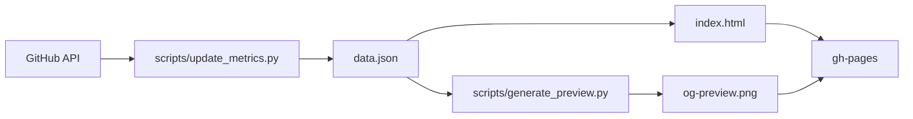

# shellaquiles/stats

[](https://shellaquiles.github.io/stats/)
[](https://opensource.org/licenses/MIT)
[](https://www.python.org/)
[](https://www.chartjs.org/)
[](https://playwright.dev/)
[](https://github.com/features/actions)

Dashboard web estático y automático para visualizar la **Huella Digital** y métricas de proyectos en GitHub (stars, forks, clones, commits, visitas y colaboradores). 

Impulsado por la comunidad de **[shellaquiles.org](https://shellaquiles.org)**.

<p align="center">
  <a href="https://shellaquiles.github.io/stats/">
    
  </a>
</p>

> 💡 **Tu URL personal tras hacer Fork:** `https://<TU-USUARIO>.github.io/stats/`  
> *(Por ejemplo, si tu usuario es `@pixelead0`, tu página se publicará en `https://pixelead0.github.io/stats/`).*

---

## Crea tu propio dashboard de estadísticas en 3 minutos

Solo necesitas hacer un fork. El sistema detecta tu usuario en automático y publica tus métricas sin que tengas que tocar código:

### 1. Haz Fork
Haz clic en el botón **Fork** arriba a la derecha para copiar el repo a tu cuenta u organización.

### 2. Activa GitHub Pages
1. Ve a **Settings** > **Pages** en tu repo (o entra a `https://github.com/<TU_USUARIO>/stats/settings/pages`).
2. En **Build and deployment** > **Source**, elige **Deploy from a branch**.
3. En **Branch**, selecciona **`gh-pages`** y carpeta `/(root)`.
4. Guarda los cambios.

*(Nota: Si la rama `gh-pages` aún no aparece, se creará sola al terminar el paso 3. Para más detalles puedes ver la [documentación oficial de GitHub Pages](https://docs.github.com/es/pages/getting-started-with-github-pages/configuring-a-publishing-source-for-your-github-pages-site)).*

### 3. Corre la sincronización inicial
1. Ve a la pestaña **Actions** en tu repo.
2. Si los workflows están pausados, presiona el botón verde para activarlos (*"I understand my workflows, go ahead and enable them"*).
3. Selecciona **`Auto-Sync Telemetry & Deploy to GitHub Pages`** a la izquierda.
4. Haz clic en **Run workflow** > **Run workflow** (ver [cómo ejecutar workflows manualmente](https://docs.github.com/es/actions/managing-workflow-runs/manually-running-a-workflow)).

### 4. Consulta tus resultados en vivo

Cuando el workflow termine de ejecutarse (tarda ~1 minuto):

1. **Tu Dashboard público**: Estará publicado en:
   ```text
   https://<TU_USUARIO>.github.io/stats/
   ```
2. **Tu Tarjeta Social**: Se habrá generado la miniatura `og-preview.png` (2400x1260 px) para compartir en redes.
3. **Historial de ejecuciones**: Puedes ver el estado de cada corrida en la pestaña **Actions** de tu repositorio.

> 📌 **Tip:** Agrega tu enlace `https://<TU_USUARIO>.github.io/stats/` en la sección **About** (en el engrane ⚙️ a la derecha de la portada de tu repo en GitHub) y marca la casilla *"Use your GitHub Pages website"*. Así tú y tus visitantes podrán entrar con 1 solo clic.

A partir de este momento, tus métricas se actualizarán en automático todos los días a las **06:00 UTC**.

---

## ¿Qué incluye el dashboard?

GitHub muestra tu actividad reciente, pero no te da una vista global del impacto de tus proyectos. Este dashboard genera una página web pública y ligera con:

- **Huella Digital**: Radar multieje con el balance de Stars, Forks, Commits, Clones y Visitas.
- **Stats Globales**: Tabla interactiva para ordenar tus repositorios por cualquier métrica o fecha de creación.
- **Por Repositorio**: Tarjetas individuales con stack técnico y enlaces a código/demos.
- **Colaboradores y Core Team**: Reconocimiento a quienes aportan código a tus repos (sin bots).
- **Captura para Redes Sociales**: Genera en automático una tarjeta `og-preview.png` en alta resolución (2400x1260 px) para compartir en Twitter/X o LinkedIn.
- **Zero-Config**: Filtra en automático tus repos públicos propios (`type=source`) y se actualiza solo cada 24 horas vía GitHub Actions sin costo de servidores.

---

## Desarrollo local

Si quieres probarlo en tu máquina:

```bash
# 1. Clonar
git clone https://github.com/<TU_USUARIO>/stats.git
cd stats

# 2. Correr servidor local (http://localhost:8000)
make dev

# 3. Generar la captura para redes
make preview
```

---

## Arquitectura



```text
├── .github/workflows/sync_metrics.yml   # Automatización CI/CD
├── scripts/
│   ├── update_metrics.py               # Extractor de datos (GitHub API)
│   └── generate_preview.py             # Generador de tarjeta social (Playwright)
├── templates/
│   └── share.html                      # Plantilla para la captura social
├── index.html                          # Dashboard web interactivo
├── Makefile                            # Comandos de desarrollo local
├── VERSION                             # Versión oficial (1.0.0)
├── CHANGELOG.md                        # Historial de cambios
└── README.md                           # Documentación del proyecto
```

- **Extractor**: Python puro con GitHub CLI (`gh`). Filtra forks (`--source`), auto-detecta usuario/org y calcula antigüedad.
- **Frontend**: HTML5, Vanilla CSS y Vanilla JS. Sin frameworks pesados. Gráficos con Chart.js e iconos Lucide.
- **Captura Social**: Playwright headless renderizando `templates/share.html` a escala 2x Retina.
- **Despliegue**: GitHub Actions publicando a rama huérfana `gh-pages`.

---

## Sobre Shellaquiles

Este proyecto es parte de las herramientas de código abierto desarrolladas por la comunidad de **[shellaquiles.org](https://shellaquiles.org)**. Si te gusta el desarrollo de herramientas de terminal, CLI y utilidades para devs, únete a la comunidad:

- Web: [https://shellaquiles.org](https://shellaquiles.org)
- GitHub: [https://github.com/shellaquiles](https://github.com/shellaquiles)
- Otros proyectos: `cron-quiles`, `tribuTACOS`, `pandocquiles`, `KARNITAS`.

---

## Licencia

MIT © Shellaquiles.
